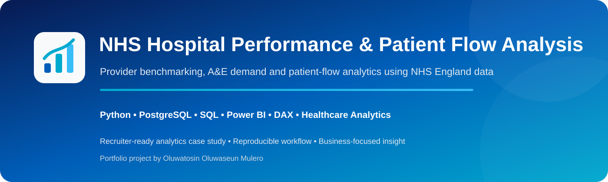
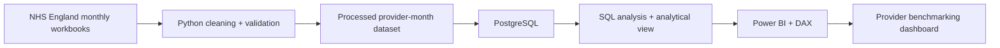
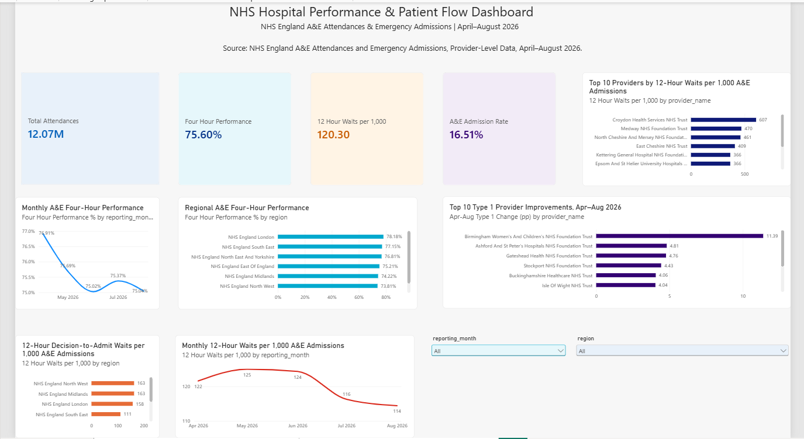
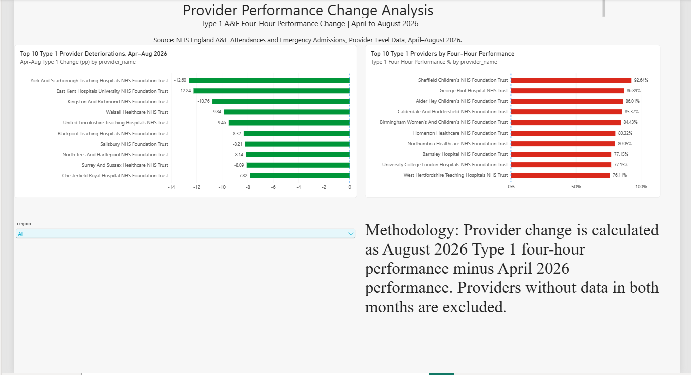

<p align="center">
  
</p>

<p align="center">
  
  
  
  
  
  
  
</p>

<p align="center"><b>Python • PostgreSQL • SQL • Power BI • DAX • Healthcare Analytics</b></p>

An end-to-end NHS England A&E analytics project examining demand, four-hour performance, regional variation, decision-to-admit delays, 12-hour waits and Type 1 provider performance change from **April to August 2026**.

> **Interpretation standard:** provider comparisons are contextualised by department type and data-quality notes. Correlation is not presented as causation.

---

## 🎯 Executive Snapshot

| KPI | Result |
| --- | ---: |
| Analysis period | **Apr–Aug 2026** |
| Provider-month records | **956** |
| Unique provider codes | **192** |
| Type 1 benchmark providers | **120** |
| July A&E attendances | **2,487,580** |
| April national 4-hour performance | **76.91%** |
| August national 4-hour performance | **75.04%** |
| Provider-level correlation | **r = -0.235** |

---

## 🧩 Business Problem

The project asks:

1. How did A&E demand change between April and August 2026?
2. How did national four-hour performance change?
3. How did performance vary across NHS England regions?
4. Which Type 1 providers improved or deteriorated most?
5. Where were 12-hour decision-to-admit waits most prevalent?
6. What relationship exists between four-hour performance and severe admission delays?
7. How stable was the composition of A&E demand?

---

## 🏗️ Analytical Architecture



Full design: [`docs/TECHNICAL_ARCHITECTURE.md`](docs/TECHNICAL_ARCHITECTURE.md)

---

## 📊 Dashboard



### Provider Performance Change Analysis



---

## 🔎 Key Findings

- A&E attendances peaked in **July 2026 at 2,487,580**.
- National four-hour performance declined from **76.91% in April** to **75.04% in August**.
- All seven NHS England regions recorded lower four-hour performance in August than in April.
- The largest April-to-August regional declines were approximately **-2.48 percentage points** in both East of England and South East.
- The lowest Type 1 performance quartile recorded **136.80 twelve-hour waits per 1,000 admissions** versus **88.90** in the top quartile.
- The provider-level correlation between four-hour performance and 12-hour waits was **r = -0.235**, a weak negative association.
- Birmingham Women's and Children's NHS Foundation Trust improved by **+11.39 percentage points**.
- York and Scarborough Teaching Hospitals NHS Foundation Trust deteriorated by **-12.60 percentage points**.

---

## 💼 Decision-Support Recommendations

- Use provider benchmarking to identify organisations requiring deeper operational investigation.
- Track severe admission-delay rates alongside four-hour performance rather than relying on one KPI.
- Monitor month-on-month provider change to detect emerging operational deterioration.
- Interpret regional/provider comparisons alongside service configuration, case mix and local conditions.
- Maintain explicit data-quality flags where source submissions may be revised.

---

## 🧠 Analytical Engineering

The project demonstrates:

- import and standardisation of five NHS Excel workbooks;
- provider/month identifier validation;
- reconciliation of attendance and performance totals;
- duplicate and missing-value checks;
- PostgreSQL analytical storage;
- SQL-based national, regional and provider benchmarking;
- a reusable Power BI analytical view;
- DAX measures for four-hour performance, admission rate, 12-hour waits and provider change;
- weighted/aggregated percentage calculation rather than averaging provider percentages.

---

## 🧰 Technology Stack

<p>
  
  
  
  
  
  
  
</p>

**Python · pandas · PostgreSQL · SQL · Power BI · Power Query · DAX · Jupyter · Git · GitHub · VS Code**

---

## ✅ Quality & Reproducibility

The repository includes an automated **Portfolio Quality** workflow validating required notebook, SQL, dashboard and documentation assets.

---

## ⚖️ Methodology & Limitations

- Provider benchmarking focuses on **Type 1 Major A&E departments** to improve comparability.
- Four-hour performance is calculated from aggregated counts, not by averaging provider percentages.
- Twelve-hour waits are normalised per 1,000 A&E admissions.
- The observed correlation between performance measures is not causal.
- East Kent Hospitals University NHS Foundation Trust's July 2026 source data was flagged as incomplete and subject to revision.
- Provider performance should be interpreted alongside case mix, service configuration and local operating context.

---

## 📁 Repository Structure

```text
nhs-hospital-performance-analysis/
├── .github/workflows/portfolio-quality.yml
├── data/
├── docs/
├── images/
│   ├── readme/hero.svg
│   ├── nhs_dashboard_overview.png
│   └── nhs_provider_change_analysis.png
├── notebooks/
├── powerbi/
├── sql/
└── README.md
```

---

## 👨🏾‍💻 Author

**Oluwatosin Oluwaseun Mulero**  
**Data Analyst | Data Scientist | Business Intelligence**
